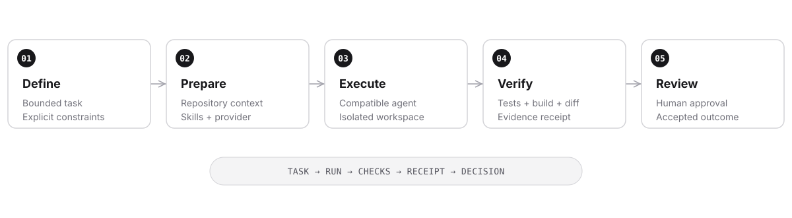

  

  <a href="https://sklab.cc">Website</a> ·
  <a href="https://github.com/sklabstudio?tab=repositories">Repositories</a> ·
  <a href="https://github.com/sklabstudio/apivouch">APIVouch</a>

---

## Build agents. Verify outcomes.

SKLab Studio is an independent engineering lab building local-first AI-agent
infrastructure, developer tools, and reproducible verification systems.

The current focus is a single control plane for giving an agent a bounded task,
running it in a controlled environment, and returning evidence that can be
reviewed before a result is accepted.

  

| Local first | Evidence over claims | Human controlled |
| :--- | :--- | :--- |
| Work stays close to the repository and its tools. | Tests, builds, diffs, and receipts determine success. | Sensitive actions remain explicit and reviewable. |

## Featured work

| Project | What it does |
| :--- | :--- |
| **[Orchestrator](https://github.com/sklabstudio/orchestrator)** | Coordinates context, agents, providers, environments, retries, and verification. |
| **[Agent Adapters](https://github.com/sklabstudio/agent-adapters)** | Provides one normalized interface for discovering and controlling coding agents. |
| **[ReproBox](https://github.com/sklabstudio/reprobox)** | Runs work in reproducible environments and records execution receipts. |
| **[PatchBench](https://github.com/sklabstudio/patchbench)** | Verifies generated patches with tests, builds, and diff analysis. |
| **[RepoContext](https://github.com/sklabstudio/repo-context)** | Turns a codebase into deterministic, AI-ready context. |
| **[Web UI](https://github.com/sklabstudio/web-ui)** | Provides the browser-based human control plane for the integrated stack. |

<strong>Explore the wider system</strong>

 

| Area | Projects |
| :--- | :--- |
| Control | [SKLab CLI](https://github.com/sklabstudio/sklab-cli) · [Web UI](https://github.com/sklabstudio/web-ui) |
| Agent runtime | [Orchestrator](https://github.com/sklabstudio/orchestrator) · [Agent Adapters](https://github.com/sklabstudio/agent-adapters) · [Provider Connections](https://github.com/sklabstudio/provider-connections) |
| Context & execution | [RepoContext](https://github.com/sklabstudio/repo-context) · [Skill Hub](https://github.com/sklabstudio/skill-hub) · [ReproBox](https://github.com/sklabstudio/reprobox) |
| Evaluation | [PatchBench](https://github.com/sklabstudio/patchbench) · [BenchSuite](https://github.com/sklabstudio/benchsuite) · [PromptBench](https://github.com/sklabstudio/promptbench) · [CodeTrials](https://github.com/sklabstudio/codetrials) |
| Engineering tools | [Coding Lab](https://github.com/sklabstudio/coding-lab) · [Contract Toolkit](https://github.com/sklabstudio/contract-toolkit) · [Cyber Pack](https://github.com/sklabstudio/cyber-pack) · [Starters](https://github.com/sklabstudio/starters) |

## APIVouch

**[APIVouch](https://github.com/sklabstudio/apivouch)** routes an agent goal across
independent APIs and returns a verified outcome with content-addressed evidence
receipts. It is a focused product, separate from the long-term SKLab platform.

`Build` → `Verify` → `MCPize` → `Monetize`

## Engineering standard

- Publish working code with a defined scope, setup path, and honest limitations.
- Treat availability as a signal, never as proof that execution succeeded.
- Prefer deterministic checks and reproducible environments over confident prose.
- Keep credentials out of repositories and inject them only when execution needs them.
- Separate experiments from stable interfaces; archive work that is no longer maintained.

## Stack

`Python` · `FastAPI` · `TypeScript` · `Next.js` · `Docker` · `Git` · `REST` · `MCP`

Small, proven components. Clear boundaries. Results that can be inspected.

---

  <a href="https://sklab.cc">sklab.cc</a> 
  Independent software experiments, AI tools, and developer infrastructure.

